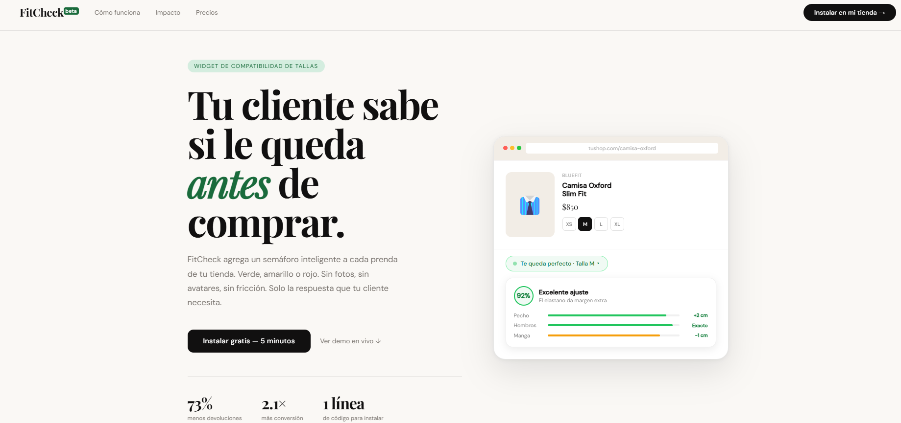

👕 FitCheck — El semáforo de tallas para tu tienda
"Un widget inteligente y dinámico diseñado para integrarse en e-commerce, reduciendo la tasa de devoluciones y mejorando la experiencia de compra del usuario mediante un sistema visual de recomendación."

🚀 El Problema y la Solución
En el comercio electrónico de indumentaria, uno de los mayores dolores de cabeza (tanto para el usuario como para las tiendas) es la incertidumbre con los talles, lo que deriva en carritos abandonados o altas tasas de devolución física.

## Preview

FitCheck resuelve esto de forma intuitiva. A través de un widget interactivo, el usuario ingresa sus medidas básicas y el sistema procesa la información devolviendo una recomendación instantánea basada en un código de colores (tipo semáforo):

🟢 Verde: Talle ideal, calce óptimo.

🟡 Amarillo: Calce ajustado o suelto (según preferencia).

🔴 Rojo: No recomendado.

💻 Stack Tecnológico

Frontend: HTML5, CSS3, JavaScript (ES6+) / React

Despliegue y Hosting: Vercel

Control de Versiones: GitHub

⚙️ Características Clave del Proyecto
Interfaz Responsive: Diseñado con un enfoque mobile-first, garantizando que el widget y la landing page se adapten perfectamente a cualquier dispositivo móvil o tablet.

Lógica de Negocio Adaptable: El algoritmo calcula de forma dinámica la compatibilidad basándose en tablas de talles específicas.

Landing Page de Conversión: Creación de una página de aterrizaje optimizada, con un diseño limpio y profesional, enfocada en mostrar los beneficios del producto B2B.

🛠️ Desafíos Técnicos y Aprendizajes

Desafío: Desarrollar una lógica de comparación de datos que sea precisa pero que no afecte el rendimiento de la página de carga del e-commerce.

Solución: Se implementó un script liviano en JavaScript puro que procesa las variables de manera local.

